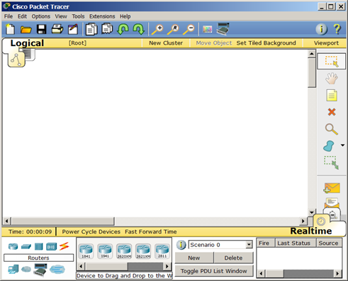
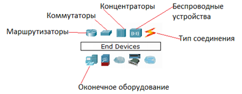
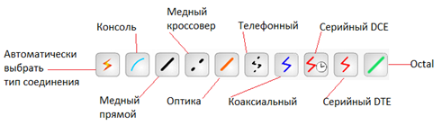
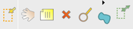
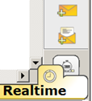
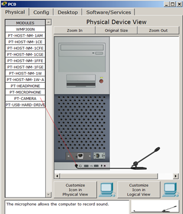

# Лабораторная работа №2

## Введение в программу Packet Tracer

### Интерфейс программы



### Главное меню

- File (Файл) - содержит операции открытия/сохранения документов
- Edit (Правка) - содержит стандартные операции "копировать/вырезать, отменить/повторить"
- Options (Настройки) – содержит настройки программы. В частности, здесь расположена кнопка , позволяющая производить локализацию программы на другие языки
- View (Вид) - содержит инструменты изменения масштаба рабочей области и панели инструментов
- Tools (Инструменты) - содержит цветовую палитру и окно пользовательских устройств
- Exensions (Расширения) - содержит мастер проектов и ряд других инструментов
- Help (Помощь)–содержит помощь по программе

### Панель инструментов


Панель инструментов с помощью пиктограмм дублирует основные пункты главного меню программы.

### Оборудование

Снизу, под рабочей областью, расположена панель оборудования. Данная панель содержит в своей левой части типы (классы) устройств, а в правой части – их наименование (модели). При наведении на каждое из устройств, в прямоугольнике, находящемся в центре между ними будет отображаться его тип.



- Маршрутизаторы (роутеры) используется для поиска оптимального маршрута передачи данных на основании алгоритмов маршрутизации
- Коммутаторы - устройства, предназначенные для объединения нескольких узлов в пределах одного или нескольких сегментах сети. Коммутатор (свитч)передаёт пакеты информации на основании таблицы коммутации, поэтому трафик идёт только на тот MAC-адрес, которому он предназначается, а не повторяется на всех портах, как на концентраторе (хабе).
- Беспроводные устройства в программе представлены беспроводным маршрутизатором и тремя точками доступа. 
- Среди конечных устройств вы увидите ПК, ноутбук, сервер, принтер, телефоны и так далее. Интернет в программе представлен в виде облаков и модемов DSL.

### Линии связи

С помощью линий связи создаются соединения узлов сети в единую топологию и при этом каждый тип кабеля может быть соединен лишь с определенными типами интерфейсов устройств.



- Автоматический тип – при данном типе соединения Packet Tracer автоматически выбирает наиболее предпочтительные тип соединения для выбранных устройств
- Консоль – консольные соединение. Консольное соединение может быть выполнено между ПК и маршрутизаторами или коммутаторами
- Медь прямой – соединение медным кабелем типа витая пара, оба конца кабеля обжаты в одинаковой раскладке
- Медь кроссовер – соединение медным кабелем типа витая пара, концы кабеля обжаты как кроссовер
- Оптика – соединение при помощи оптического кабеля, необходимо для соединения устройств, имеющих оптические интерфейсы
- Телефонный кабель – кабель для подключения телефонных аппаратов. Соединение через телефонную линию может быть осуществлено между устройствами, имеющими модемные порты. Пример - ПК, дозванивающийся в сетевое облако
- Коаксиальный кабель – соединение устройств с помощью коаксиального кабеля. Используется для соединения между кабельным модемом и облаком
- Серийный DCE и серийный DTE - соединения через последовательные порты для связей Интернет. Для настройки таких соединений необходимо установить синхронизацию на стороне DCE-устройства. Сторону DCE можно определить по маленькой иконке "часов" рядом с портом.

### Графическое меню



- Инструмент Select (Выбрать) можно активировать клавишей Esc. Он используется для выделения одного или более объектов для дальнейшего их перемещения, копирования или удаления
- Инструмент Move Layout (Переместить слой, горячая клавиша M) используется для прокрутки больших проектов сетей
- Инструмент Place Note (Сделать пометку, клавиша N) добавляет текст в рабочей области проекта
- Инструмент Delete (Удалить, клавиша Del) удаляет выделенный объект или группу объектов
- Инструмент Inspect (Проверка, клавиша I) позволяет, в зависимости от типа устройства, просматривать содержимое таблиц (ARP, NAT, таблицы маршрутизациии др.)
- Инструмент Drawapolygon (Нарисовать многоугольник) позволяет рисовать прямоугольники, эллипсы, линии и закрашивать их цветом
- Инструмент Resize Shape (Изменить размер формы, комбинация клавиш Alt+R) предназначен для изменения размеров рисованных объектов (четырехугольников и окружностей)

### Элементы анимации и симуляции



Инструменты Add Simple PDU (Добавить простой PDU, клавиша P) и Add Complex PDU (Добавить комплексный PDU, клавиша C) предназначены для эмулирования отправки пакета с последующим отслеживанием его маршрута и данных внутри пакета.

### Физическое представление оборудования

В программе возможно физическое представление оборудования в виде его физической конфигурации.



Для изменения комплектации оборудования необходимо отключить его питание, кликнув мышью на кнопке питания и перетащить мышью нужный модуль в свободный слот, затем включить питание.

### Настройка IP оборудования

Щелкаем мышью на нужное устройство, переходим на вкладку Desktop, далее в Ip Configuration.

Для запуска консоли в этой же вкладке Desktop выбираем Command Prompt.

## Задание №1

Создать сеть из двух ПК, настроить ее работу, проверить работу с помощью запуска команды ping с одного устройства на другое по IP-адресу.

## Задание №2

Сформировать сеть из четырех ПК и двух хабов. Задайте для каждого IP-адрес и маску сети 255.255.255.0

Попробуйте пропинговать с разных компьютеров другие компьютеры. Какие можно сделать выводы?

## Задание №3

Добавить в сеть из прошлого задания еще один ПК. Для конфигурирования IP-адреса и маски использовать консоль.

Команда:

```
ipconfig ip-адрес маска
```

С помощью ipconfig без параметров проверить сетевые настройки у других устройств сети. 

## Задание №4

Необходимо настроить статическую маршрутизацию. Выполните следующие шаги:

1. Добавьте маршрутизатор 1841 на рабочее пространство
2. Добавьте два ПК на рабочее пространство
3. Соедините компьютеры с одним из Ethernet-портов маршрутизатора (например, портами FastEthernet0/0 и FastEthernet0/1).
4. Выберите маршрутизатор и перейдите в CLI. Войдте в режим конфигурации, введя команду `enable`, а затем `configure terminal`.
5. Настройте интерфейсы маршрутизатора. Например, для интерфейса FastEthernet0/0 нужно выполнить следующие команды: `interface FastEthernet0/0`, затем `ip address 192.168.1.1 255.255.255.0` и `no shutdown`
6. Для интерфейса FastEthernet0/1 можно выполнить аналогичные команды, но с другим IP-адресом, например, 192.168.2.1.
7. Выберите каждый компьютер и настройте IP-адреса в той же подсети, что и соответствующий интерфейс маршрутизатора. Например:
   1. PC0: IP-адрес 192.168.1.2, маска подсети 255.255.255.0, шлюз по умолчанию 192.168.1.1. 
   2. PC1: IP-адрес 192.168.2.2, маска подсети 255.255.255.0, шлюз по умолчанию 192.168.2.1.
8. Чтобы маршрутизатор знал, как доставлять пакеты между двумя подсетями, настройте на нем статический маршрут. Например: `ip route 192.168.2.0 255.255.255.0 FastEthernet0/1`
9. Убедитесь, что связи акивны (зеленые треугольники)
10. Пропингуйте с одного компьютера другой и убедитесь, что пакеты доставляются корректно
    