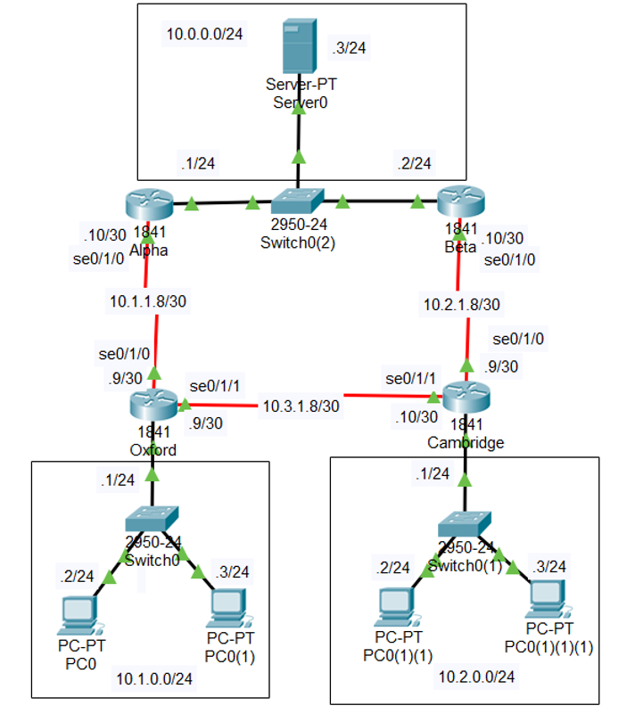

# Лабораторная работа №3

Компания British University Bookstores имеет центральный офис в Лондоне и сеть филиалов по Великобритании. Филиалы подсоединены к центральному офису по выделенным линиям; их обслуживают два центральных маршрутизатора Alpha и Beta, соединенных между собой в локальной сети Ethernet.

Пример сети:

В обычной обстановке каждый филиал использует вертикальный канал для связи с центральным офисом и горизонтальный канал для связи с соседним филиалом. В случае обрыва вертикального канала обмен данными с центральным офисом должен автоматически переключаться на маршрут, ведущий через соседний филиал. В случае обрыва горизонтального канала обмен данными между филиалами должен автоматически переключаться на маршрут через Лондон. Вам необходимо построить приведенную на рисунке сеть и реализовать маршрутизацию, как указано выше. Использовать статические маршруты.

Для подключения роутера к роутеру необходимо поставить в роутеры дополнительные модули `WIC-1T` (убедитесь, что появились порты Serial). Соединять по новым портам следует кабелем `Serial DCE`.
