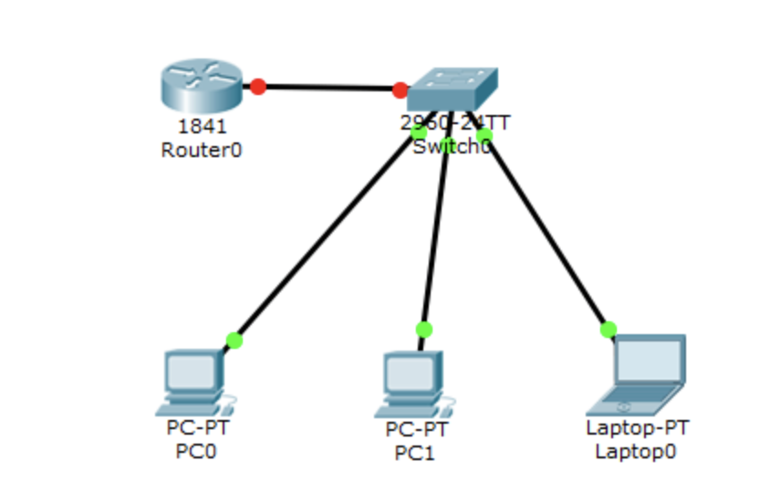
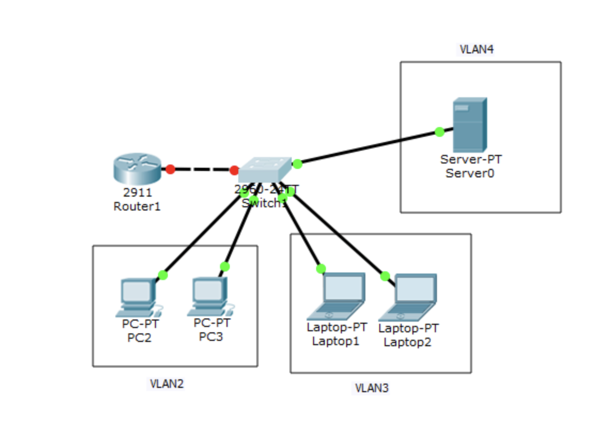

# Лабораторная работа №4

## DHCP №1

Построить сеть по схеме:



Настроить роутер:

1. Включить порт, подключенный к коммутатору и назначить ему ip `192.168.1.1/24`
2. Создать на роутере pool ip адресов с помощью команды `ip dhcp pool DHCP_192.168.1.0`
3. Создать на роутере сеть с помощью команды `network 192.168.1.0 255.255.255.0`
4. Задать на роутере шлюз по умолчанию с помощью команды `default-router 192.168.1.1`
5. Задать на роутере DNS-сервер с помощью команды `dns-server 192.168.1.2`
6. Включить на первом компьютере получение адреса по `DHCP` во вкладке `Config`.
7. Прописать команду `ipconfig` на первом ПК и убедиться, что он получил свой ip-адрес.
8. Включить `DHCP` на остальных компьютерах.
9. Пропинговать компьютеры между собой и убедиться, что сеть работает корректно.
 
## DHCP №2

Построить сеть по схеме:



1. На коммутаторе создать подсети с помощью команд:
```
enable
conf t
vlan 2
name VLAN2
exit
vlan 3
name VLAN3
exit
vlan 4
name VLAN4
exit
```
2. Настроить порты коммутатора и добавить к ним нужный vlan с помощью команд:
```
int range fa0/1-2
switchport mode access
switchport access vlan 2
exit

int range fa0/3-4
witchport mode access
switchport access vlan 3
exit

int fa 0/5
switchport mode access
switchport access vlan 4
exit
```
3. Настроить порт подключения коммутатора к роутеру с помощью команд:
```
int fa0/1
switchport mode trunk
switchport trunk allowed vlan 2,3,4
exit
```
4. На роутере включить порт, подключенный к коммутатору
5. Настроить роутер с помощью команд:
```
int gi0/0.2
encapsulation dot1Q 2
ip address 192.168.2.251 255.255.255.0
exit

int gi0/0.3
encapsulation dot1Q 3
ip address 192.168.3.251 255.255.255.0
exit

int gi0/0.4
encapsulation dot1Q 4
ip address 192.168.4.251 255.255.255.0
exit

ip routing
do wr mem
```
6. Включить на всех ПК `DHCP` и пингом проверить, что компьютеры связаны между собой
