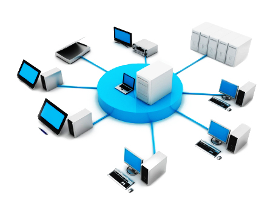
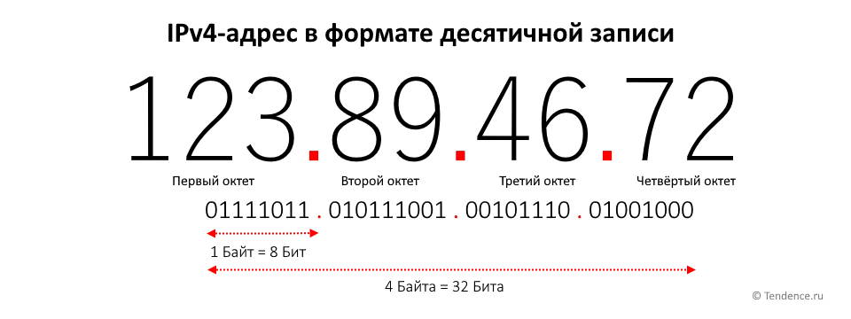
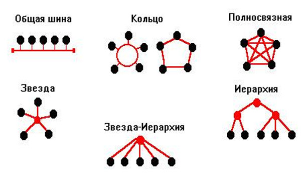

# Введение в компьютерные сети

## Определение

Компьютерная сеть – это инфраструктура, позволяющая устройствам взаимодействовать и обмениваться данными друг с другом. Эти устройства могут включать в себя компьютеры, мобильные устройства, серверы, маршрутизаторы, переключатели и многие другие.

Суть компьютерной сети заключается в том, что она позволяет устройствам обмениваться информацией – будь то текстовые данные, изображения, аудио или видео. Компьютерные сети предоставляют нам возможность разделять ресурсы, совместно работать над проектами, обмениваться знаниями и обеспечивать доступ к глобальной информационной сети – Интернету.

Важно заметить, что компьютерные сети могут быть организованы на различных масштабах, от небольших домашних сетей до огромных корпоративных и глобальных сетей, охватывающих всю планету.

## Основные понятия

### Узел (устройство) и хост

В мире компьютерных сетей термины "узел" и "хост" часто используются для обозначения устройств, подключенных к сети. Узел – это любое устройство, способное обмениваться данными в сети. Хост – это конкретный тип узла, который может быть идентифицирован в сети уникальным адресом.

Примеры узлов в компьютерных сетях включают в себя компьютеры, ноутбуки, смартфоны, серверы, маршрутизаторы и принтеры. Хосты, будучи активными участниками сети, выполняют разнообразные функции – от обмена данными до предоставления услуг другим хостам.

### Серверы и клиенты

Очень важными понятиями в компьютерных сетях являются "серверы" и "клиенты". Сервер – это специализированный хост, предоставляющий определенные услуги или ресурсы другим устройствам в сети. Примеры серверов включают веб-серверы (предоставляющие веб-страницы), электронные почтовые серверы (отправляющие и получающие электронные письма) и файловые серверы (хранящие и обеспечивающие доступ к файлам).

Клиенты – это устройства, которые запрашивают услуги или ресурсы у серверов. Например, ваш компьютер может быть клиентом, запрашивающим веб-страницы у веб-сервера, или почтовым клиентом, отправляющим письмо на почтовый сервер.

### Протоколы

Протоколы – это наборы правил и соглашений, которые регулируют обмен данными между устройствами в компьютерной сети. Протоколы определяют, как данные упаковываются, передаются, получаются и интерпретируются. Они играют критическую роль в обеспечении надежного и эффективного обмена информацией.

Примеры известных протоколов включают HTTP (протокол передачи гипертекста) для веб-сайтов, SMTP (простой протокол передачи почты) для отправки электронной почты и TCP/IP (протокол управления передачей/протокол интернета) – основу сетей Интернет.

### IP-адреса

IP-адрес (адрес интернет-протокола) – это уникальный числовой идентификатор, присвоенный каждому устройству в сети. IP-адреса используются для определения и адресации устройств в сети, а также для маршрутизации данных от отправителя к получателю.

IP-адрес состоит из двух частей: сетевой и хостовой. Сетевая часть идентифицирует конкретную сеть, к которой принадлежит устройство, а хостовая – само устройство внутри этой сети.

### Маршрутизаторы и коммутаторы

Маршрутизаторы и коммутаторы – это ключевые устройства, обеспечивающие передачу данных в сети.

Маршрутизаторы – это устройства, принимающие данные из одной сети и пересылающие их в другую сеть. Они принимают решения о передаче данных, основываясь на IP-адресах и другой информации.

Коммутаторы – это устройства, которые управляют передачей данных внутри одной сети. Они анализируют MAC-адреса (физические адреса устройств) и эффективно пересылают данные только тому устройству, для которого данные предназначены.

## Типы сетей

### Локальные сети (LAN)

Локальная сеть, или LAN (Local Area Network), представляет собой сеть, охватывающую ограниченную территорию, обычно в пределах здания, кампуса или небольшой географической области. Примеры использования локальных сетей включают в себя домашние сети, офисные сети, сети в учебных заведениях и т. д.

### Топологии сетей

Локальные сети могут быть организованы в различных топологиях, определяющих способ подключения устройств друг к другу. Существует несколько основных типов топологий:

- Звезда: В этой топологии все устройства подключены к центральному устройству (часто коммутатору или маршрутизатору). Звездообразная топология обеспечивает высокую надежность, но отказ центрального устройства может привести к неработоспособности всей сети.
- Шина: В этой топологии все устройства подключены к общей шине. Шина – это один провод, который проходит через все устройства. Шиновая топология проста, но уязвима к отказам и перегрузкам.
- Кольцо: В этой топологии устройства подключены в кольцо, где каждое устройство соединено с двумя соседними. Кольцевая топология более устойчива к отказам, чем шина, но отказ одного устройства может привести к проблемам во всем кольце.

### Глобальные сети (WAN)

Глобальная сеть, или WAN (Wide Area Network), охватывает более широкую географическую область, такую как регион, страна или весь мир. Примером глобальной сети является Интернет, который связывает миллионы компьютеров по всему миру.

WAN обеспечивается провайдерами связи, которые предоставляют инфраструктуру и услуги для передачи данных между разными устройствами и сетями. Провайдеры могут использовать различные технологии передачи данных, чтобы обеспечить широкополосный доступ и стабильное соединение.

Для передачи данных по глобальным сетям используются различные технологии:

- DSL (Digital Subscriber Line): Эта технология позволяет передавать данные через обычные телефонные линии, обеспечивая высокую скорость передачи в пределах домов и офисов.
- Кабель: Кабельные сети используют телевизионные кабели для передачи данных. Они предоставляют высокую скорость и широкополосный доступ.
- Оптоволокно: Эта технология использует стеклянные или пластиковые волоконные кабели для передачи данных с очень высокой скоростью и низкой задержкой.

## Процесс передачи данных

Процесс передачи данных в сети можно представить как отправку письма по почте. Давайте разберем этот процесс на следующих этапах:

### Этап 1: Источник данных

В начале стоит источник данных, например, ваш компьютер, отправляющий электронное письмо. Эти данные могут быть текстом, изображениями, видео и т. д.

### Этап 2: Разделение на пакеты

Для более эффективной передачи данных их обычно разделяют на небольшие пакеты. Каждый пакет содержит часть информации, а также информацию о порядке сборки и адресе назначения.

### Этап 3: Маршрутизация

После разделения на пакеты данные отправляются в сеть. Здесь вступает в игру маршрутизация. Маршрутизаторы – это устройства, которые определяют оптимальный путь для передачи данных от источника к приемнику. Они используют информацию в заголовках пакетов и таблицы маршрутизации.

### Этап 4: Коммутация

Когда пакеты достигают маршрутизаторов, они могут быть пересланы через различные пути в зависимости от сетевой нагрузки и доступности маршрутов. Этот процесс называется коммутацией.

### Этап 5: Сборка пакетов

По мере доставки пакетов к месту назначения они собираются обратно в исходные данные. Это осуществляется на стороне приемника.

### Этап 6: Приемник данных

После сборки пакетов данные достигают приемника – компьютера, телефона или другого устройства, для которого данные предназначены.

