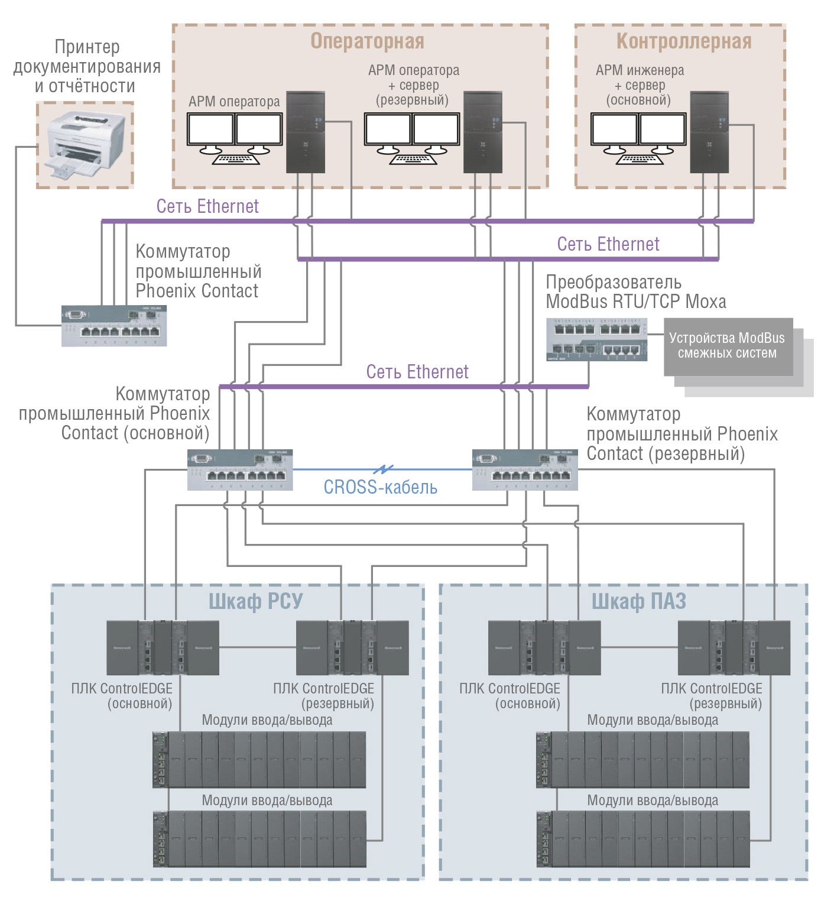
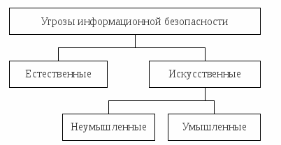
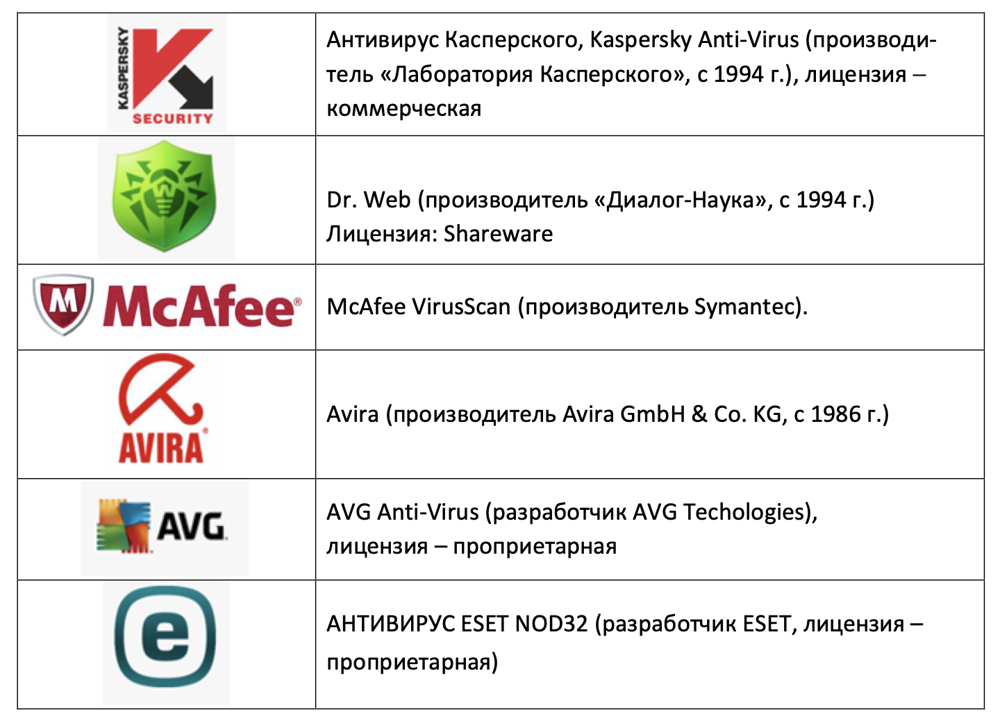

# Безопасность в компьютерных сетях

Большинство современных автоматизированных систем обработки информации представляют собой распределенные системы, построенные на стандартных сетевых архитектурах и использующие типовые наборы сетевых сервисов и прикладного программного обеспечения. Корпоративные сети «наследуют» все «традиционные» для локальных вычислительных систем способы несанкционированного вмешательства. Кроме того, для них характерны и специфические каналы проникновения и несанкционированного доступа к информации, обусловленные использованием сетевых технологий.

Основные особенности распределенных вычислительных систем:

- территориальная удаленность компонентов системы и наличие интенсивного обмена информацией между ними;
- широкий спектр используемых способов представления, хранения и передачи информации;
- интеграция данных различного назначения, принадлежащих различным субъектам, в рамках единых баз данных и, наоборот, размещение необходимых некоторым субъектам данных в различных удаленных узлах сети;
- абстрагирование владельцев данных от физических структур и места размещения данных;
- использование режимов распределенной обработки данных;
- участие в процессе автоматизированной обработки информации большого количества пользователей и персонала различных категорий;
- непосредственный и одновременный доступ к ресурсам большого числа пользователей;
разнородность используемых средств вычислительной техники и программного обеспечения;

## Уязвимость компонентов распределенных АС

В общем случае ЛВС состоит из следующих основных структурно-функциональных элементов:

- рабочих станций;
- серверов;
- межсетевых коммуникационных узлов (шлюзов, мостов, маршрутизаторов);
- каналов связи.

### Рабочие станции

Рабочие станции считаются наиболее доступными компонентами сетей и именно с них могут быть предприняты наиболее многочисленные попытки совершения несанкционированных действий.

С рабочих станций осуществляется управление процессами обработки информации, запуск программ, ввод и корректировка данных, на дисках рабочих станций могут размещаться важные данные и программы обработки.

На видеомониторы и печатающие устройства рабочих станций выводится информация при работе пользователей, выполняющих различные функции и имеющих разные полномочия по доступу к ресурсам системы.

### Серверы и коммуникационное оборудование

Серверы и коммуникационное оборудование нуждаются в особой защите, поскольку наиболее привлекательны с точки зрения злоумышленников. Первые — как концентраторы больших объемов информации, вторые — как элементы, в которых осуществляется преобразование (возможно через открытую, нешифрованную форму представления) данных при согласовании протоколов обмена в различных участках сети.

### Каналы связи

Каналы связи, в силу большой пространственной протяженности через неконтролируемую или слабо контролируемую территорию, представляют возможность как прямого подключения к ним, так и вмешательства в процесс передачи данных.

## Угрозы безопасности информации

Под угрозой обычно понимают потенциально возможное событие, действие, процесс или явление, которое может привести к нанесению ущерба чьим-либо интересам. Угрозой интересам субъектов информационных отношений будем называть такое событие, процесс или явление, которое посредством воздействия на информацию или другие компоненты АС может прямо или косвенно привести к нанесению ущерба интересам данных субъектов.

В силу приведенных ранее особенностей современных АС, существует значительное число различных видов угроз.

### Виды угроз информационной безопасности

Основными видами угроз безопасности сети являются:

- стихийные бедствия и аварии (наводнение, ураган, землетрясение, пожар и т.п.);
- сбои и отказы оборудования (технических средств) АС;
- последствия ошибок в проектировании и разработке компонентов АС (аппаратных средств, технологии обработки информации, программ, структур данных и т.п.);
- ошибки эксплуатации (пользователей, операторов и другого персонала)
- преднамеренные действия нарушителей и злоумышленников (обиженных лиц из числа персонала, преступников, шпионов, диверсантов и т.п.).

Все виды могут быть классифицированы по разным признакам, что позволяет более эффективно использовать средства защиты информации.

### Классификация угроз информационной безопасности

Все множество потенциальных угроз по природе их возникновения разделяется на два класса: естественные (объективные) и искусственные (субъективные)

#### Естественные угрозы

Естественные угрозы — это объективные, не зависимые от человека, факторы, способные нарушить безопасность сети. Угрозы этого типа относят к форс-мажорным.

#### Искусственные угрозы

Искусственные угрозы, напротив, вызваны преднамеренной (умышленные угрозы) или непреднамеренной (неумышленные) деятельностью человека:

- неумышленные угрозы — связаны с ошибками в проектировании и развертывании сети, ошибками в программном обеспечении, в действиях персонала и т.п.;
- умышленные угрозы — основаны на корыстных устремлениях людей (злоумышленников).

Источники угроз по отношению к ЛВС разделяются на:

- внутренние — структурные элементы самой сети, включая аппаратное, программное обеспечение и обслуживающий персонал;
- внешние — все прочие.

##### Основные непреднамеренные искусственные угрозы

УК РФ. Глава 28. Преступления в сфере компьютерной информации.

Статья 274. Нарушение правил эксплуатации ЭВМ, системы ЭВМ или их сети.

1. Нарушение правил эксплуатации ЭВМ, системы ЭВМ или их сети лицом, имеющим доступ к ЭВМ, системе ЭВМ или их сети, повлекшее уничтожение, блокирование или модификацию охраняемой законом информации ЭВМ, если это деяние причинило существенный вред, — наказывается лишением права занимать определенные должности или заниматься определенной деятельностью на срок до пяти лет, либо обязательными работами на срок от ста восьмидесяти до двухсот сорока часов, либо ограничением свободы на срок до двух лет.

2. То же деяние, повлекшее по неосторожности тяжкие последствия, — наказывается лишением свободы на срок до четырех лет.

Основные непреднамеренные искусственные угрозы АС (действия, совершаемые людьми случайно, по незнанию, невнимательности или халатности, из любопытства, но без злого умысла):

1. неумышленные действия, приводящие к частичному или полному отказу системы или разрушению аппаратных, программных, информационных ресурсов системы (неумышленная порча оборудования, удаление, искажение файлов с важной информацией или программ, в том числе системных и т.п.);
2. неправомерное включение оборудования или изменение режимов работы устройств и программ;
3. неумышленная порча носителей информации;
4. запуск технологических программ, способных при некомпетентном использовании вызывать потерю работоспособности системы (зависания или зацикливания) или осуществляющих необратимые изменения в системе (форматирование или реструктуризацию носителей информации, удаление данных и т.п.);
5. нелегальное внедрение и использование неучтенных программ (игровых, обучающих, технологических и др., не являющихся необходимыми для выполнения нарушителем своих служебных обязанностей) с последующим необоснованным расходованием ресурсов (загрузка процессора, захват оперативной памяти и памяти на внешних носителях);
6. заражение компьютера вирусами;
7. неосторожные действия, приводящие к разглашению конфиденциальной информации, или делающие ее общедоступной;
8. разглашение, передача или утрата атрибутов разграничения доступа (паролей, ключей шифрования, идентификационных карточек, пропусков и т.п.);
9. проектирование архитектуры системы, технологии обработки данных, разработка прикладных программ, с возможностями, представляющими опасность для работоспособности системы и безопасности информации;
10. игнорирование организационных ограничений (установленных правил) при ранге в системе;
11. вход в систему в обход средств защиты (загрузка посторонней операционной системы со сменных магнитных носителей и т.п.);
12. некомпетентное использование, настройка или неправомерное отключение средств защиты персоналом службы безопасности;
13. пересылка данных по ошибочному адресу абонента (устройства);
14. ввод ошибочных данных;
15. неумышленное повреждение каналов связи.

##### Основные преднамеренные искусственные угрозы

УК РФ. Глава 28. Преступления в сфере компьютерной информации.

Статья 272. Неправомерный доступ к компьютерной информации.

1. Неправомерный доступ к охраняемой законом компьютерной информации, то есть информации на машинном носителе, в электронно-вычислительной машине (ЭВМ), системе ЭВМ или их сети, если это деяние повлекло уничтожение, блокирование, модификацию либо копирование информации, нарушение работы ЭВМ, системы ЭВМ или их сети, — наказывается штрафом в размере от двухсот до пятисот минимальных размеров оплаты труда или в размере заработной платы или иного дохода осужденного за период от двух до пяти месяцев, либо исправительными работами на срок от шести месяцев до одного года, либо лишением свободы на срок до двух лет.

2. То же деяние, совершенное группой лиц по предварительному сговору или организованной группой либо лицом с использованием своего служебного положения, а равно имеющим доступ к ЭВМ, системе ЭВМ или их сети, — наказывается штрафом в размере от пятисот до восьмисот минимальных размеров оплаты труда или в размере заработной платы или иного дохода осужденного за период от пяти до восьми месяцев, либо исправительными работами на срок от одного года до двух лет, либо арестом на срок от трех до шести месяцев, либо лишением свободы на срок до пяти лет.

Основные возможные пути умышленной дезорганизации работы, вывода системы из строя, проникновения в систему и несанкционированного доступа к информации:

1. физическое разрушение системы или вывод из строя всех или отдельных наиболее важных компонентов компьютерной системы;
2. вывод из строя подсистем обеспечения функционирования сети;
3. дезорганизация функционирования системы (изменение режимов работы устройств или программ, забастовка, саботаж персонала, постановка мощных активных радиопомех на частотах работы устройств системы и т.п.);
4. внедрение агентов в число персонала системы (в том числе, возможно, и в административную группу, отвечающую за безопасность);
5. вербовка (путем подкупа, шантажа и т.п.) персонала или отдельных пользователей, имеющих определенные полномочия;
6. применение подслушивающих устройств, дистанционная фото- и видеосъемка и т.п.;
7. перехват побочных электромагнитных, акустических и других излучений устройств и линий связи, а также наводок активных излучений на вспомогательные технические средства, непосредственно не участвующие в обработке информации (телефонные линии, сети питания, отопления и т.п.);
8. перехват данных, передаваемых по каналам связи, и их анализ с целью выяснения протоколов обмена, правил вхождения в связь и авторизации пользователя и последующих попыток их имитации для проникновения в систему;
9. хищение носителей информации;
10. несанкционированное копирование носителей информации;
11. хищение производственных отходов (распечаток, записей, списанных носителей информации и т.п.);
12. чтение остаточной информации из оперативной памяти и с внешних запоминающих устройств;
13. чтение информации из областей оперативной памяти, используемых операционной системой (в том числе подсистемой защиты) или другими пользователями, в асинхронном режиме используя недостатки мультизадачных операционных систем и систем программирования;
14. незаконное получение паролей и других реквизитов разграничения доступа с дальнейшим их использованием;
15. несанкционированное использование терминалов пользователей, имеющих уникальные физические характеристики, такие как номер рабочей станции в сети, физический адрес, адрес в системе связи, аппаратный блок кодирования и т.п.;
16. вскрытие криптографических шифров;
17. внедрение аппаратных и программных "закладок" и "вирусов";
18. незаконное подключение к линиям связи с целью работы "между строк", с использованием пауз в действиях законного пользователя от его имени с последующим вводом ложных сообщений или модификацией передаваемых сообщений;
19. незаконное подключение к линиям связи с целью прямой подмены законного пользователя путем его физического отключения после входа в систему и успешной аутентификации с последующим вводом дезинформации и навязыванием ложных сообщений.

УК РФ. Глава 28. Преступления в сфере компьютерной информации

Статья 273. Создание, использование и распространение вредоносных программ для ЭВМ

1. Создание программ для ЭВМ или внесение изменений в существующие программы, заведомо приводящих к несанкционированному уничтожению, блокированию, модификации либо копированию информации, нарушению работы ЭВМ, системы ЭВМ или их сети, а равно использование либо распространение таких программ или машинных носителей с такими программами — наказываются лишением свободы на срок до трех лет со штрафом в размере от двухсот до пятисот минимальных размеров оплаты труда или в размере заработной платы или иного дохода осужденного за период от двух до пяти месяцев.

2. Те же деяния, повлекшие по неосторожности тяжкие последствия, — наказываются лишением свободы на срок от трех до семи лет.

Следует заметить, что чаще всего для достижения поставленной цели злоумышленник использует не один, а несколько перечисленных выше путей.

## Компьютерная безопасность и защита информации

### Необходимость защиты информации

Информационная безопасность – состояние сохранности информационных ресурсов и
защищённости законных прав личности и общества в информационной сфере.

Существует достаточно много возможных направлений утечки информации и путей
несанкционированного доступа в вычислительных системах и сетях. В их числе:

- чтение остаточной информации в памяти компьютера после выполнения санкционированных запросов;
- копирование носителей информации и файлов информации с преодолением мер защиты;
- маскировка под зарегистрированного пользователя;
- маскировка под запрос системы;
- использованием программных ловушек;
- использование недостатков операционной системы;
- незаконное подключение к аппаратуре и линиям связи;
- злоумышленный вывод из строя механизмов защиты;
- внедрение и использование компьютерных вирусов.

Угрозы безопасности информации возникают и при использовании электронной почты. К ним относятся:

- Адреса электронной почты используются для рассылки спама. Адрес попадает в базы данных спамеров незаконным путем.
- Адреса электронной почты в Интернете легко подделать. Практически нельзя сказать наверняка, кто написал и послал электронное письмо.
- Электронные письма могут быть легко модифицированы. Стандартное SMTP3 письмо не содержит средств проверки целостности.
- Существует ряд мест, где содержимое письма может быть прочитано теми, кому
оно не предназначено. Электронное письмо скорее похоже на открытку — его могут прочитать на каждой промежуточной станции.
- Нет гарантий доставки электронного письма. Хотя некоторые почтовые системы
предоставляют пользователям возможность получить сообщение о доставке, часто такие уведомления означают лишь то, что почтовый сервер получателя (а не
обязательно сам пользователь) получил сообщение.
- Почтовая бомба — это атака с помощью электронной почты. Атакуемая система
переполняется письмами до тех пор, пока она не выйдет из строя.
- Фишинг (англ. phishing, от phony – обман и fishing – рыбная ловля, выуживание) - вид интернет-мошенничества, цель которого получить идентификационные
данные пользователей. Организаторы рассылают письма, в которых созданы
ссылки на сайты, которые являются копией настоящих.
- «Нигерийские письма» - вид интернет-мошенничества, цель которого поиск
жертвы, которая будет переводить деньги за несуществующие товары, услуги,
мероприятия.

### Методы защиты информации

#### Ограничение доступа к информации

Заключается в создании некоторой физической4 замкнутой преграды вокруг объекта защиты с организацией контрольного доступа лиц, связанных с объектом защиты по своим
функциональным обязанностям, т.е. выделение специальных территорий, специальных зданий и помещений, создание контрольно-пропускного режима. Задача подобных
средств ограничения доступа – исключить случайный и преднамеренный доступ посторонних лиц к комплексам средств автоматизации. Ограничение доступа к информации
обеспечивается и с помощью аппаратных средств с самым различными принципами действия. Так, в целях контроля доступа к внутренним линиям связи и технологическим органам управления используется аппаратура контроля вскрытия устройств.

#### Распределение доступа к информации

Заключается в разделении информации на части и организации доступа к ним пользователей в соответствии с их функциональными обязанностями и полномочиями. Деление информации может производиться по степени важности или секретности, по функциональному назначению и другим признакам. Задача этого метода – существенно затруднить преднамеренный перехват информации нарушителем, предусмотреть механизм разделения привилегий при доступе к особо важным данным.

#### Криптографическое преобразование информации

Этот метод повышает безопасность передачи данных в сетях ЭВМ, данных в удаленных
устройствах памяти и при обмене информацией между удаленными объектами. Защита
информации методом криптографического преобразования6 заключается в преобразовании ее составных частей (слов, букв, цифр, слогов) с помощью специальных алгоритмов и
аппаратных решений. Управление процессом шифрования осуществляется с помощью периодически меняющегося кода ключей, обеспечивающего каждый раз оригинальное представления информации при использовании одного и того же алгоритма или устройства.
Без знания ключа эта процедура может быть практически невыполнима даже при известном алгоритме шифрования. Для ознакомления с зашифрованной информацией применяется процесс декодирования информации. Появление и развитие электронных элементов
позволили разработать недорогие устройства, обеспечивающие преобразование информации.

## Компьютерные вирусы

Компьютерный вирус – это специально написанная программа, как правило, небольшая по размерам, способная самопроизвольно присоединяться к другим программам,
создавать свои копии и внедрять их в файлы, системные области дисков и в вычислительные сети (причем эти копии сохраняют способность к размножению) с целью
нарушения работы программ, порчи файлов и каталогов, создания всевозможных помех
в работе на компьютере.

Основные признаки проявления вирусов:
- невозможность загрузки операционной системы;
- прекращение работы или неправильная работа ранее успешно функционировавших программ;
- блокировка ввода с клавиатуры;
- замедление работы компьютера;
- изменение размеров, даты и времени создания файлов;
- значительное увеличение количества файлов на диске;
- исчезновение файлов и каталогов или искажение их содержимого;
- существенное уменьшение размера свободной оперативной памяти;
- блокировка записи на жесткий диск;
- непредусмотренное требование снять защиту с дискеты;
- вывод на экран непредусмотренных сообщений или изображений;
- подача непредусмотренных звуковых сигналов;
- частые «зависания» и сбои в работе компьютера.

Для защиты от компьютерных вирусов следует соблюдать основные правила работы
на ПК:

- установить на компьютере современное вирусное программное обеспечение и постоянно обновлять его;
- перед считывание информации с переносных источников памяти (дискет лазерных
дисков и флэш-карт) всегда проверять их на наличие вирусов;
- при переносе на компьютер файлов в архивированном виде проверять сам архив
или файлы в процессе их распаковки на жесткий диск (такая возможность предусмотрена современными антивирусными программами);
- использовать антивирусные программы для контроля всех файлов, получаемых из
компьютерных сетей;
- периодически проверять на наличие вирусов жесткие диски компьютера, запуская
антивирусные программы для тестирования памяти, системных областей дисков и
файлов, предварительно загрузив операционную систему с защищенного от записи
системного диска (компакт-диска или флэш-карты);
- защищать дискеты (флэш-карты) от записи при работе на других компьютерах, если на них не должна производиться запись информации;
- обязательно делать архивные копии информации на альтернативных носителях
(дисках или флэш-картах).

### Классификация компьютерных вирусов

По разрушительным возможностям выделяют три вида вирусов:

- Неопасные вирусы. Они уменьшают объем памяти в результате своего распространения и иногда выдают какие-либо текстовые, графические или звуковые сообщения, но не осуществляют сознательной порчи информации;
- Опасные вирусы. Приводят к различным нарушениям в работе компьютера,
например, выполняют перезагрузку компьютера, блокируют или изменяют функции клавиш клавиатуры, замедляют работу компьютера и т.п.;
- Очень опасные вирусы. Приводят к потере программ и данных, стиранию информации в системных областях памяти и даже к выходу из строя комплектующих частей компьютера, например, жесткого диска и материнской платы.

По способу заражения выделяют два вида вирусов:

- Резидентные вирусы при заражении компьютера оставляют в оперативной памяти
свою резидентную часть, которая потом перехватывает обращение операционной
системы ко всем объектам (файлам, загрузочным секторам дисков и т.п.) и внедряется в них. Резидентные вирусы находятся в памяти и являются активными вплоть
до выключения или перезагрузки компьютера.
- Нерезидентные вирусы не заражают память компьютера и являются активными
ограниченное время. Такие вирусы активизируются в определенные моменты,
например, при обработке документов текстовым процессором.

По среде обитания выделяют четыре вида вирусов:

- Файловые вирусы заражают исполняемые файлы (.exe, .com) и различные вспомогательные файлы, загружаемые при выполнении других программ. Вирус в зараженных файлах начинает свою работу при запуске той программы, в которой он
находится. Некоторые вирусы умеют заражать драйверы устройств. Такой вирус
начинает свою работу при загрузке данного драйвера;
- Загрузочные вирусы внедряются в начальный сектор дисков, содержащий загрузчик операционной системы. Такие вирусы начинают свою работу при загрузке
компьютера с зараженного диска. Загрузочные вирусы являются резидентными и
заражают вставляемые в компьютер диски;
- Файлово-загрузочные вирусы заражают одновременно файлы и загрузочные сек-
тора дисков (часто заражают системные файлы). Как правило, такие вирусы имеют
довольно сложный алгоритм работы, часто применяют оригинальные методы про-
никновения в систему, используют технологии «стелс» и «полиморфик»;
- Сетевые вирусы распространяются по различным компьютерным сетям, например, по сети интернет. Такие вирусы самостоятельно передают свой код на удаленный сервер или рабочую станцию. Часто сетевые вирусы обладают еще и возможностью запустить на выполнение свой код на удаленном компьютере или, по крайне мере, «подтолкнуть» пользователя к запуску зараженного файла.

По особенностям алгоритма выделяют семь видов вирусов:

- Компаньоны (спутники) не изменяют файлы, а создают для исполняемых программ (.exe) одноименные командные программы (.com), которые при выполнении исходной программы запускаются первыми, а затем передают управление исход ной программе (существовали ранее, обычно в ОС DOS);
- Репликаторы (черви) распространяются по компьютерным сетям, проникая в память компьютеров, вычисляя адреса других сетевых компьютеров и рассылая по
ним свои копии. Такие вирусы не изменяют файлы или сектора на дисках;
- Паразиты при распространении своих копий изменяют содержимое файлов и секторов диска. К этой группе относятся вирусы, не являющиеся спутниками и червями;
- Троянские вирусы (квазивирусы) маскируются под какие-нибудь полезные программы и активизируются при наступлении некоторого события (условия срабатывания). Такие вирусы содержат некоторые деструктивные действия, связанные с
нарушением безопасности компьютерной системы, например, передают конфиденциальную информацию (пароли) или модифицируют программы систем защиты;
- Невидимки (стелс) перехватывают обращения операционной системы к пораженным файлам и секторам дисков и подставляют вместо себя незараженные файлы участки диска, поэтому их очень трудно обнаружить и обезвредить;
- Мутанты (призраки) также маскируются, постоянно модифицируя себя таким образом, что не содержат одинаковых фрагментов. Такие вирусы содержат алгоритмы шифровки-расшифровки и хранят свое тело в закодированном виде, постоянно
меняя параметры кодировки. Поэтому такие вирусы самые сложные в обнаружении;
- Макровирусы заражают документы, в которых предусмотрено выполнение макрокоманд (макросов). При открытии такого документа вначале исполняются содержащиеся в нем макросы (в том числе и макровирусы). Таким образом, вирус получает управление и совершает все вредные действия (в частности, находит и заражает еще не зараженные документы).

