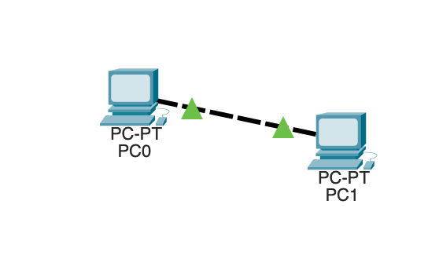
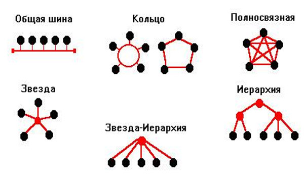

# Основные принципы построения компьютерных сетей

## Простейшая сеть из двух компьютеров

Главной целью объединения компьютеров в сеть было разделение ресурсов: пользователи компьютеров, подключенных к сети, или приложения, выполняемые на этих компьютерах, получают возможность доступа к ресурсам компьютеров сети, к таким как:

- Периферийные устройства, такие как диски, принтеры, плоттеры, сканеры и др.
- Данные, хранящиеся в оперативной памяти или на внешних запоминающих устройствах
- Вычислительная мощность

## Сетевые интерфейсы

Сетевой интерфейс, также известный как сетевой адаптер или сетевая карта, представляет собой физическое или виртуальное устройство, которое позволяет компьютеру подключаться к сети и обмениваться данными с другими устройствами в этой сети. Он служит мостом между программными приложениями и физическими средствами сети.

### Типы сетевых интерфейсов

1. Физические сетевые интерфейсы: Это аппаратные устройства, такие как сетевые карты Ethernet, Wi-Fi адаптеры и сетевые карты для мобильных сетей. Они предоставляют физическое соединение с сетью.

2. Виртуальные сетевые интерфейсы: Эти интерфейсы создаются программно и используются для различных целей, включая виртуальные частные сети (VPN), виртуальные маршрутизаторы и виртуальные адаптеры.

### Основные характеристики сетевых интерфейсов

1. MAC-адрес: Каждый физический сетевой интерфейс имеет уникальный MAC-адрес, который идентифицирует его в сети.

MAC-адрес (MAC, Media Access Control address) - это уникальный идентификатор, который присваивается каждому сетевому интерфейсу, такому как сетевая карта Ethernet, в рамках локальной сети (LAN). MAC-адрес используется на физическом уровне сети для идентификации устройства в сети.

- Формат MAC-адреса: MAC-адрес состоит из 12 шестнадцатеричных символов, разделенных двоеточиями или дефисами. Например, "00:1A:2B:3C:4D:5E" или "00-1A-2B-3C-4D-5E". Эти символы представляют собой комбинацию букв A-F и цифр 0-9.
- Уникальность: MAC-адрес уникален для каждого сетевого интерфейса. Это означает, что ни одно другое устройство в мире не должно иметь точно такой же MAC-адрес. Производители сетевых устройств, таких как сетевые карты и маршрутизаторы, должны гарантировать уникальность MAC-адресов, которые они присваивают своим устройствам.
- Протоколы, использующие MAC-адреса: MAC-адреса широко используются в сетях Ethernet, но они также могут применяться в других типах сетей, таких как Wi-Fi, Bluetooth и других технологиях беспроводной связи. Они играют ключевую роль в протоколах на физическом уровне сети.
- Смена MAC-адреса: В некоторых случаях пользователи могут изменять MAC-адрес своего сетевого интерфейса с помощью специальных программ или команд. Это может быть полезно для обеспечения анонимности или обхода ограничений сети, но такие действия могут быть незаконными в некоторых странах.
- Защита MAC-адресов: В сетях, где требуется высокая безопасность, могут быть применены механизмы для защиты от манипуляций с MAC-адресами, такие как MAC-фильтрация или протоколы аутентификации на более высоких уровнях стека сетевых протоколов.

1. IP-адрес: Сетевой интерфейс может быть настроен с IP-адресом, который используется для маршрутизации и идентификации в сети.

2. Пропускная способность: Это скорость передачи данных через интерфейс, измеряемая в битах в секунду (бит/с) или байтах в секунду (Байт/с).

3. Режим работы: Физические сетевые интерфейсы могут работать в разных режимах, таких как полудуплексный и полнодуплексный, в зависимости от способности устройства принимать и передавать данные одновременно.

#### Полудуплексный режим (Half-Duplex)

В полудуплексном режиме сетевой интерфейс может либо принимать данные (получать), либо передавать данные (отправлять), но не может выполнять оба действия одновременно.

Этот режим подходит для ситуаций, где не требуется высокая пропускная способность или где устройства могут работать в режиме "говори-слушай" и передавать данные по очереди.

Примером использования полудуплексного режима может быть полудуплексное Ethernet соединение, где устройства чередуют передачу и прием данных по сети.

#### Полнодуплексный режим (Full-Duplex)

В полнодуплексном режиме сетевой интерфейс способен одновременно принимать и передавать данные.

Этот режим обеспечивает более высокую пропускную способность и эффективность сети, так как устройства могут работать в режиме "говори и слушай" одновременно, что уменьшает задержки и повышает производительность.

Полнодуплексный режим часто используется в современных сетях, особенно в сетях Ethernet, где устройства, такие как коммутаторы и сетевые карты, поддерживают этот режим.

Выбор между полудуплексным и полнодуплексным режимами зависит от типа сетевого оборудования, его способностей и потребностей сети. Полнодуплексный режим предпочтителен там, где необходима высокая скорость передачи данных и минимальные задержки, в то время как полудуплексный режим может быть использован, если пропускная способность не является критической и ресурсы ограничены.

## Топология сетей

Объединяя в сеть несколько (больше двух) компьютеров, необходимо решить, каким образом соединить их друг с другом, иначе, выбрать конфигурацию физических связей, или топологию.

Под топологией сети понимается конфигурация графа, вершинам которого соответствуют конечные узлы сети (например, компьютеры) и коммуникационное оборудование (например, маршрутизаторы), а ребрам — физические или информационные связи между вершинами.

Можно соединять каждый компьютер с каждым или же связывать их последовательно, предполагая, что они будут общаться, передавая сообщения друг другу «транзитом». В качестве транзитного узла может выступать как универсальный компьютер, так и специализированное устройство.

От выбора топологии связей существенно зависят характеристики сети:

- Наличие между узлами нескольких путей повышает надежность сети и делает возможным распределение нагрузки между отдельными каналами.

- Простота присоединения новых узлов, свойственная некоторым топологиям, делает сеть легко расширяемой.

- Экономические соображения часто приводят к выбору топологий, для которых характерна минимальная суммарная длина линий связи.

### Типы топологий

- Кольцевая топология. Данные передаются по кольцу от одного компьютера к другому. Главным достоинством кольца является то, что оно по своей природе обеспечивает резервирование связей. Данные в кольце, сделав полный оборот, возвращаются к узлу-источнику. Поэтому источник может контролировать процесс доставки данных адресату. Это свойство используется для тестирования связности сети и поиска узла, работающего некорректно. В то же время в сетях с кольцевой топологией необходимо принимать специальные меры, чтобы в случае выхода из строя или отключения какого-либо компьютера не прерывался канал связи между остальными узлами кольца.

- Звездообразная топология образуется в случае, когда каждый компьютер подключается непосредственно к общему центральному устройству, называемому концентратором. В функции концентратора входит направление передаваемой компьютером информации одному или всем остальным компьютерам сети. В качестве концентратора может выступать как универсальный компьютер, так и специализированное устройство. Недостатки звездообразной топологии: более высокая стоимость сетевого оборудования из-за необходимости приобретения специализированного центрального устройства; возможности по наращиванию количества узлов в сети ограничиваются количеством портов концентратора.

- Иногда имеет смысл строить сеть с использованием нескольких концентраторов, иерархически соединенных между собой звездообразными связями. Получаемую в результате структуру называют иерархической звездой, или деревом. В настоящее время дерево является самой распространенной топологией связи, как в локальных, так и глобальных сетях.

- Особым частным случаем звезды является общая шина. Здесь в качестве центрального элемента выступает пассивный кабель (такую же топологию имеют многие сети, использующие беспроводную связь — роль общей шины здесь играет общая радиосреда). Передаваемая информация распространяется по кабелю и доступна одновременно всем компьютерам, присоединенным к этому кабелю. Достоинства: дешевизна и простота присоединения новых узлов к сети, а недостатками — низкая надежность (любой дефект кабеля полностью парализует всю сеть) и невысокая производительность (в каждый момент времени только один компьютер может передавать данные по сети, поэтому пропускная способность делится здесь между всеми узлами сети).

